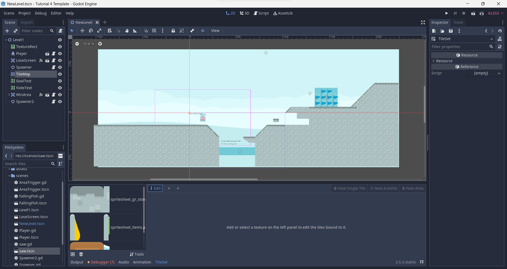
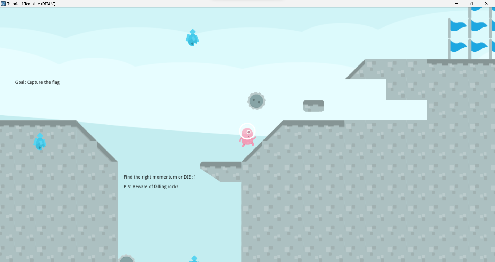

# Tutorial 3 - Game Development 2023/2024

> Godot Version: 3.5.3

## Latihan Mandiri: Membuat Level Baru Dengan Tile Map & Obstacle Berbeda

Sebagai bagian dari latihan mandiri, kamu diminta untuk praktik membuat level baru yang berbeda dari level pertama. Kebutuhan minimum yang harus diimplementasikan pada level baru:

1. Level menggunakan tile map yang berbeda dari level pertama.

    Implementasi level baru `NewLevel.tscn` menggunakan tile map yang berbeda dapat dilakukan dengan membuat `TileMap` dan `TileSet` baru. Kemudian, kita tinggal memilih *asset* yang akan digunakan pada `TileSet` tersebut. Berikut adalah hasil dari penggunaan `TileMap` dan `TileSet` yang baru.

    

2. Terdapat spawner rintangan di level baru yang membuat objek berbeda dari ikan dan memiliki rintangan berupa jurang dan objek yang berjatuhan secara periodik.

    Spawner rintangan baru berupa `Spawner2` yang menghasilkan *scene* `Saw` yang merupakan `RigidBody2D` yang memiliki kecepatan linear dan angular. Jika `Saw` Mengenai pemain, pemain akan mati.

    

## Sumber Referensi

1. [Godot Docs](https://docs.godotengine.org/en/stable/)